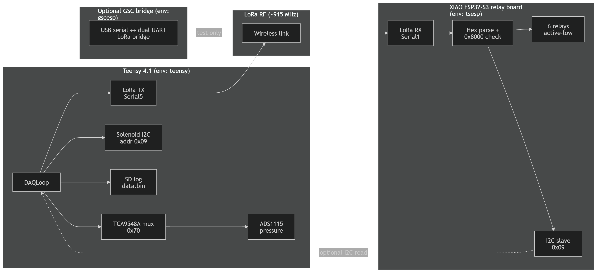

# System overview

[← Back to documentation index](../README.md)

## Purpose

This repository contains firmware for the **Torito** EECS stack: a **data acquisition (DAQ)** path on a **Teensy 4.1**, optional **SD logging**, **LoRa** telemetry toward ground systems, and **ESP32-S3** firmware for **relay/solenoid control** and **LoRa bridging**.

## Logical components

*Figure: Teensy 4.1 DAQ, I2C mux and sensors, SD and LoRa paths, LoRa RF link, and XIAO ESP32-S3 relay / I2C slave.*

- **Teensy (`teensy`)**  
  - Samples pressure channels through an **I2C mux** (TCA9548A at `0x70`) to an **ADS1115**.  
  - Reads **solenoid/relay state** from a remote I2C device (same bus topology; mux channel in [`hwconfig.h`](../../lib/DataTypes/hwconfig.h)).  
  - Pushes structured **`SampleFrame`** records through **ring buffers**; a **dispatcher** copies frames toward **SD** and **LoRa** queues.  
  - Sends **compressed telemetry** over LoRa (header serialization in `LoraSend`, not full `SampleFrame`).

- **Torito ESP (`tsesp`)**  
  - Listens on **LoRa** for hex payloads, validates the **MSB “command valid”** bit, and drives **six relay outputs** (active-low).  
  - Exposes **I2C slave** at `0x09` so a master can write/read the same 16-bit command/state.

- **GSC ESP (`gscesp`)**  
  - Uses **two UARTs** to talk to **two LoRa modules** (receive path and transmit path).  
  - Forwards received payloads to **USB serial** with a binary framing prefix (`0xAA 0x55`).  
  - Accepts **USB commands** to send `AT+SEND` on the transmit UART (test / ground support).

## Data flow (Teensy)

1. **`daq_step()`** ([`lib/DAQLoop`](../../lib/DAQLoop)) builds one `SampleFrame` per tick: sensor reads, solenoid read, sequence and timestamp.  
2. Frame is **`push`ed** to `daq_buffer`.  
3. **`dispatcher_thread_step()`** ([`lib/BufferDispatcher`](../../lib/BufferDispatcher)) **pops** from `daq_buffer`, **pushes** to `sd_buffer` for every frame, and **pushes** to `lora_buffer` every **10th** frame.  
4. **`SDWrite::data()`** batches binary frames to a file (default `data.bin` on built-in SD).  
5. **`LoraSend::send_next()`** serializes a **header subset** and sends via the LoRa AT interface.

See [Ring buffers and dispatcher](../reference/ring-buffers-and-dispatcher.md) and [Sample frame](../reference/sample-frame.md) for details.

## Related documents

- [Teensy DAQ firmware](../firmware/teensy-daq.md)  
- [GSC ESP LoRa bridge](../firmware/gscesp-lora-bridge.md)  
- [Torito ESP relay controller](../firmware/tsesp-relay-controller.md)  
- [LoRa protocols](../protocols/lora.md)  
